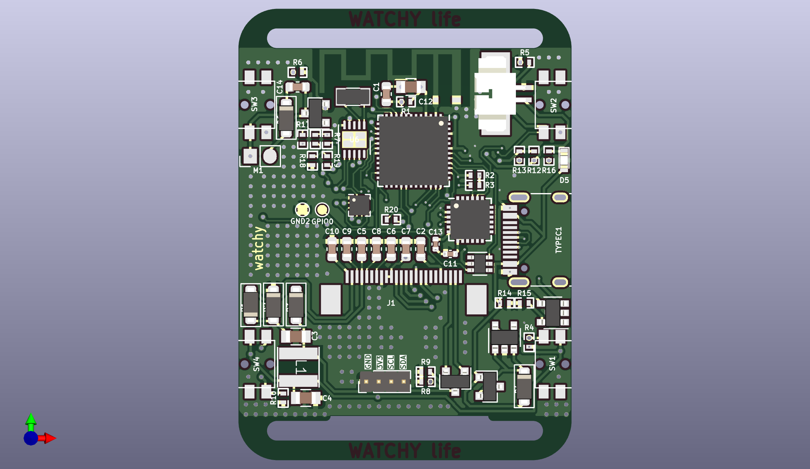
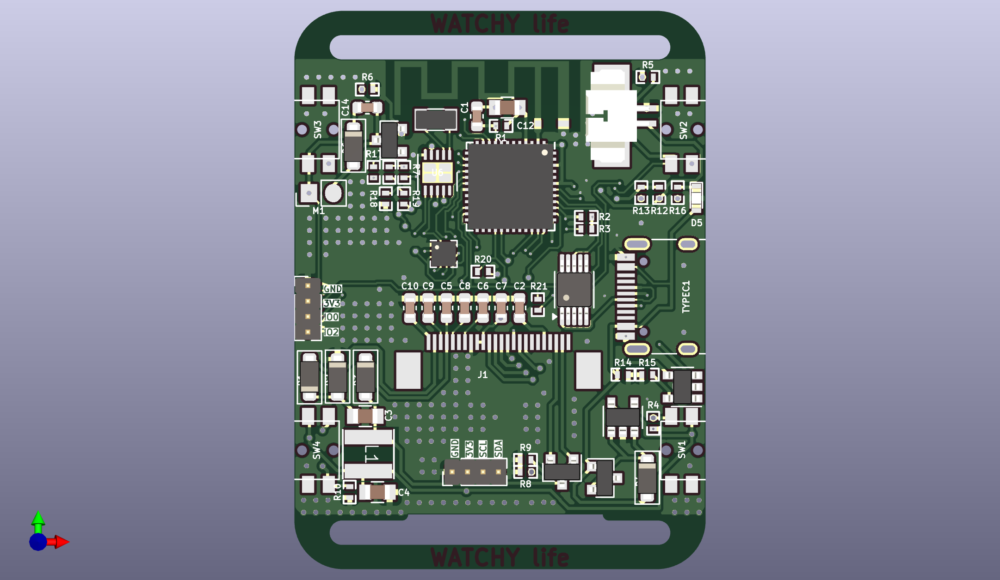

# watchy-hardware-v2
This project involves modifying the <a href="https://github.com/sqfmi/watchy-hardware">Watchy Hardware V2</a> by replacing the Micro USB port with a Type-C interface. There are two versions available for the serial chip:

* CP2102N version
* CH340X version

We recommend using the CH340X version because:

* It's cheaper
* Has a smaller package size
* Easier to solder
* Requires fewer external components

## CP2102N

## CH340X

## 中文

本项目是修改了watchy hardware v2将micro usb改成了typec接口, 针对串口芯片有两个版本:
* CP2102N
* CH340X
推荐使用 CH340X 版本, 因为CH340X便宜, 封装小, 易焊接, 外围电路少.